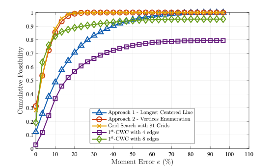

# GCWF: Geometric Contact Wrench Feasibility
[](https://ieeexplore.ieee.org/document/9931454)
[](https://ieee-iros.org)

<!-- Verifying Contact Wrench Feasibility via Geometrical Approach. -->

Example code of \
_**A Geometric Sufficient Condition for Contact Wrench Feasibility**_\
Shenggao Li* $^1$, Hua Chen $^2$, Wei Zhang $^2$, Patrick M. Wensing $^1$

## Background

In our paper, we introduced a geometry-based framework to approximate the exact Contact Wrench Cone (CWC) including two approaches with different accuracy-speed balance. By comparing to the exact CWC solved by [MOSEK][261d468d], the preferred approach 2 can find the yaw moment interval with **only 7.13% error but 140 times faster**. 

  [261d468d]: https://www.mosek.com "MOSEK"


## Dependencies and Requirements
- OS: MacOSX or Linux (x86/x64)
  - Tested on OSX Catalina 10.15 and Ubuntu 18.04
<!-- > TODO: Add support for OSX and Linux with ARM CPU. -->
- [MOSEK][261d468d] 9.3 - For solving the Second-Order-Cone-Program of exact CWC.
  - Please follow the [installation guide][004a721d], compile the [Fusion API][24aab043], and make sure your license is properly configured as explained in [license guide][833fb562].
  - Our code is developed based on MOSEK 9.3. **It should be compatible with newer 10.0 version** but has not been tested (due to our license restriction).
  - Note: the folder `<MSKHOME>` in which the MOSEK Optimization Suite has been installed would be used in later compiling procedure.
- [MATLAB][4b980ec4] 2019a or later - For sample data generation and computing statistical result. 


  [4b980ec4]: https://matlab.mathworks.com "Matlab"
  [24aab043]: https://docs.mosek.com/9.3/cxxfusion/install-interface.html# "MOSEK-INSTALL"
  [833fb562]: https://docs.mosek.com/9.3/licensing/index.html "MOSEK-LICENSE"

## Getting Started
### Install
Download this project
```
git clone https://github.com/ROAM-Lab-ND/GCWF.git
cd GCWF
```
Run the setup script and follow the instruction to configure the MOSEK library and compile this project. 
```
./setup.sh <MSKHOME>
```
> `<MSKHOME>` contains your MOSEK library like `<MSKHOME>/mosek/9.3/tools/...`
##### Available Makefile commands
1. `make clean` to remove all compiling and executable files of this project (but keeps MOSEK library).
2. `make clean_MOSEK` to clean the MOSEK library.
3. `make all` to compile all (both MOSEK library and this project).


### Run Example 
Run the script [`Matlab/SampleAndCompute.m`](Matlab/SampleAndCompute.m) in MATLAB to generate new data, run the solver, and plot the result. You should have results similar to the following:


Method                              | Error  | Standard Deviation | Computation Time ( $\mu s$ )
------------------------------------|--------|--------------------|---------------------------
$2^{\rm nd}$-CWC                    | 0%     | 0%                 | 556.97
$1^{\rm st}$-CWC (4 edges)          | 19.35% | 15.02%             | 682.29
$1^{\rm st}$-CWC (8 edges)          | 8.37%  | 9.94%              | 961.77
Appraoch 1 (Longest Centered Line)  | 18.80% | 16.63%             | 3.56
Appraoch 2 (Enumerate All Vertices) | 7.13%  | 5.54%              | 3.64
Grid Search (81 grids)              | 7.13%  | 5.56%              | 50.49
Optimal Supporting Line             | 6.50%  | 4.88%              | 2954.9

### Troubleshooting
- MOSEK is not installed: _TODO: set flag in MATLAB script to solve CWC via native MATLAB function ..._
- For Mac, run the python script in [installation guide][004a721d] is important for MOSEK.
- If both MOSEK and our project cannot be installed, you can directly run MATLAB script [`Matlab/CompareResult.m`](Matlab/CompareResult.m) and choose an example data set to see the result.

  [004a721d]: https://docs.mosek.com/9.3/install/index.html "INSTALLATION-GUIDE"

<!-- ## Usage
Direct call C++ program via command line.\
Change directory to build `cd build`\
`./build/CWC <DataPath> N_veritices N_samples ` -->


## Citation
```
@ARTICLE{li2022gcfw,  
  author={Li, Shenggao and Chen, Hua and Zhang, Wei and Wensing, Patrick M.},  
  journal={IEEE Robotics and Automation Letters},   
  title={A Geometric Sufficient Condition for Contact Wrench Feasibility},   
  year={2022},  
  volume={},  
  number={},  
  pages={1-8},  
  doi={10.1109/LRA.2022.3217687}
}
```

### Contact
$^{1}$ University of Notre Dame, South Bend, IN, US. \{sli25,pwensing\}@nd.edu\
$^{2}$ Southern University of Science and Technology, Shenzhen, China. \{chenh6,zhangw3\}@sustech.edu.cn
